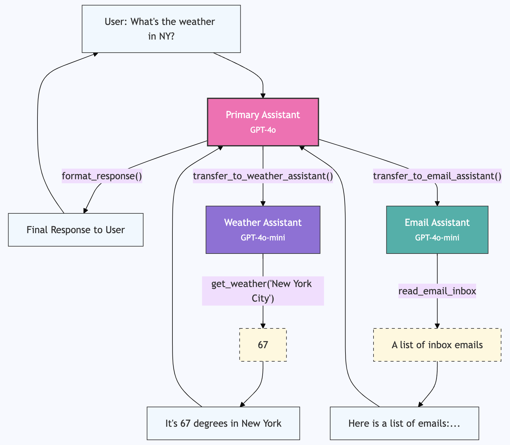

# Cue

A lightweight multi-agent system.

Cue is designed to explore the potential of multi-agent systems powered by Large Language Models (LLMs) in a minimal and efficient format. This project aims to showcase how a small-scale, yet powerful, architecture can leverage LLMs to orchestrate intelligent agents.

## Table of Contents

- [Getting Started](#getting-started)
- [Testing](#testing)
- [Evals](#evals)
- [Evals Environment](#evals-environment)
- [Deployment](#deployment)
- [File Structure](#file-structure)
- [Support LLM Client](#support-llm-client)

## Getting Started

### Step 1: Clone repository

```
git clone git@github.com:zhaolongzhong/mini-agent.git
```

### Step 2: Setup the Environment

Run the setup script to install dependencies and ensure your environment is ready:

```
./scripts/setup.sh
```

This script will:

- Check if Rye is installed and install it if necessary.
- Configure Rye and sync project dependencies.

### Step 3: Set Up API Keys

**Option 1:** Use a `.env` file to store your API keys:

1. Copy the example file:
   ```bash
   cp .env.example .env
   ```
2. Update the `.env` file with your API keys.

**Option 2:** Set the API key directly using the terminal:

```bash
export OPENAI_API_KEY="your_api_key"
```

Choose the option that best fits your workflow.

### Step 4: Run command line

Start backend server first if you use external long-term memory, which requires docker desktop running

```bash
cd backend/
./scripts/run.sh
```

Start the command line:

```bash
rye run cue -r
```

or activiate virtual environment and run `cue` command directly.

```bash
source .venv/bin/activate
```

```bash
$ cue -v
version 0.1.0
```

```bash
$ cue -h
usage: cue [-h] [-v] [-r] [-c] [--log-level {DEBUG,INFO,WARNING,ERROR,CRITICAL}] [--log-file LOG_FILE]

Cue CLI: An interactive asynchronous client.

optional arguments:
  -h, --help            show this help message and exit
  -v, --version         Print the version of the Cue client.
  -r, --run             Run the interactive CLI.
  -c, --config          Print the default configuration.
  --log-level {DEBUG,INFO,WARNING,ERROR,CRITICAL}
                        Set the logging level (overrides environment variable).
  --log-file LOG_FILE   Path to a file to log messages (overrides environment settings).
```

You can also run using the following script:

```bash
./scripts/run.sh
```

If you want to print debug log, set the following environment first,

```bash
export CUE_LOG="debug"
```

## Diagram



## Prompt Caching

Prompt caching is a crucial optimization that significantly reduces latency and token usage. This feature is foundational for building high-performance AI agent systems, enabling efficient multi-turn conversations while managing costs.

[Learn more about the implementation →](docs/prompt_caching.md)

## Testing

Run tests located in the `tests` directory using `./scripts/test.sh`.

**Note**: Running basic evaluation test requires `OPENAI_API_KEY` in `src/cue/.env`

```bash
$ ./scripts/test.sh -h
Usage: ./scripts/test.sh [options]

Options:
  -u    Run unit tests only
  -i    Run integration tests only
  -a    Run both unit and integration tests
  -e    Run basic evaluation tests (requires OPENAI_API_KEY)
  -h    Show this help message and exit

Examples:
  ./scripts/test.sh -u          # Run unit tests only
  ./scripts/test.sh -i          # Run integration tests only
  ./scripts/test.sh -a          # Run both unit and integration tests
  ./scripts/test.sh -e          # Run evaluation tests
  ./scripts/test.sh -u -e       # Run unit and evaluation tests
```

Here's an improved version of the section:

## Evals

We currently support two types of evaluations:

1. **Basic Evaluation** (`tests/evaluation`): This lightweight evaluation setup runs using pytest. You can execute it via:

   ```bash
   ./scripts/test.sh -e
   ```

2. **Detailed Evaluation** (`evals`): This is a standalone package designed for comprehensive evaluations. For detailed instructions on how to run it, please refer to [evals/README.md](evals/README.md).

The detailed evaluations are executed within the `evals` environment.

## Evals Environment

The [environment](environment/README.md) package provides a standalone setup for running evaluation tasks in Docker containers. It supports parallel execution, making it easy to manage and monitor evaluation results efficiently.

## Deployment

To build the package, run:

```bash
rye build
```

This command will generate distribution files in the `dist` directory, such as:

- `dist/cue-0.1.0-py3-none-any.whl`
- `dist/cue-0.1.0.tar.gz`

You can use these files in your CI/CD workflow (e.g., GitHub Actions):

```
pip install -q ./dist/cue-0.1.0-py3-none-any.whl

which cue

cue -v
```

This installs the package and verifies its installation and version.

## Agent Capacities

- [Operating System (OS)](./docs/os.md)
- [Coding](./docs/coding.md)

## Support LLM Client

Check a full list of supported clients at `src/cue/llm/`.

- [Anthropic](https://docs.anthropic.com/en/docs/about-claude/models)
- [OpenAI](https://platform.openai.com/docs/models)
- [Gemini](https://cloud.google.com/vertex-ai/generative-ai/docs/multimodal/call-gemini-using-openai-library#supported_models)

## Project Structure

```
- credentials/       # Contains authentication files and keys
- docs/              # Documentation for the project
- environment/       # Evals Environment
- evals/             # Full evaluations for this project
- logs/              # Log files for debugging and analysis
- src/cue/           # Main source code
  - cli/             # Interactive command-line interface
  - _client          # Asynchronous client module
- tests/             # Test cases for various modules
```
